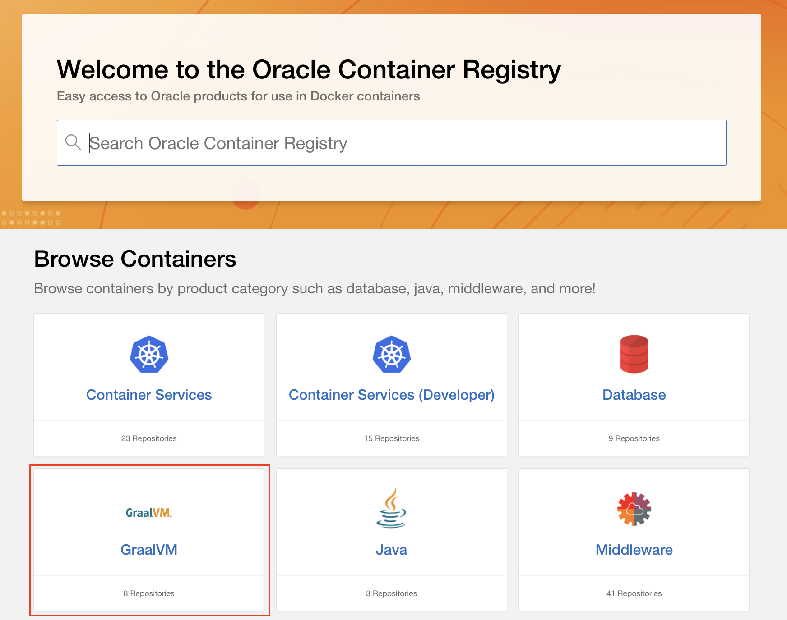

layout: docs
toc_group: container-images
link_title: Container Images
permalink: /docs/getting-started/container-images/
---

## GraalVM Enterprise Images

To support container-based development, GraalVM Enterprise container images are published in the [Oracle Container Registry](https://container-registry.oracle.com).
In this guide you will learn how to start using GraalVM Enterprise images for Docker containers.

## Images Tagging Policy and Availability

There are different images provided depending on the platform, the architecture, and the Java version.
The images are multi-arch (`aarch64` or `amd64` depending on Docker host architecture), and tagged with the format `container-registry.oracle.com/graalvm/IMAGE_NAME:version`.

The version tag defines the level of specificity.
It is recommended that the most specific tag be used, e.g., `java17-21.3.0` or `java17-21.3.0-b1`, where the `-b1` means the image required a patch and this specific build will never change. All images support the installation of extra features. 

The following GraalVM Enterprise container images are available:

| Package      | Description                                        
------------------------------------------------------------------------------------------------------------------------------------------------------------|-----------|
| enterprise          |  A GraalVM Enterprise Edition container image with the `gu` tool to install additional features. |
| jdk-ee   | A size compact GraalVM Enterprise container image with the JDK pre-installed. |
| native-image-ee | A size compact GraalVM Enterprise container image with the Native Image support. |
| nodejs-ee      | A size compact GraalVM Enterprise container image with the Node.js runtime. |

## Get Started

[Oracle Container Registry](https://container-registry.oracle.com). provides access to Oracle products to use in Docker containers. 
To start using GraalVM Enterprise images, you should accept the [Oracle Technology Network License Agreement](https://www.oracle.com/downloads/licenses/graalvm-otn-license.html). 

1. Go to [Oracle Container Registry](https://container-registry.oracle.com/) and click on “GraalVM”.You will be redirected to the GraalVM repositories page.

    

2. Click on the necessary image. For example, you need a compact container image with the JDK pre-installed. On this page, click the **jdk-ee** link.

    

3. Click on **Sign In**. This will take you to the Oracle Single Sign-on page.

    

4. Sign in with an Oracle account. If you do not have an existing Oracle account, create one.

5. Once you have signed in, you will see the following screen:

    

    Click **Continue** to accept the license and proceed ahead.

6. Check and accept the license.

    

7. Open a terminal window and `docker login` to Oracle Container Registry using your Oracle account.

    ```shell
    docker login container-registry.oracle.com
    Username: user.name@email.com
    Password: 
    Login Succeeded
    ```

8. Pull the image. You can pull a package by name or by name and version tag. Use the `docker pull` command to download the image (use the latest tag or a specific tag from the list of tags displayed on the page). For example:

    ```shell
    docker pull container-registry.oracle.com/graalvm/jdk-ee:latest
    latest: Pulling from graalvm/jdk-ee
    58c4eaffce77: Pull complete 
    8800a93aa49d: Pull complete 
    da2734fc865b: Pull complete 
    Digest: sha256:ccde822a1119da5f95e97b331632e6219b0ae29f81f516d1c0b9787
    Status: Downloaded newer image for container-registry.oracle.com/graalvm/jdk-ee:latest
    container-registry.oracle.com/graalvm/jdk-ee:latest
    ```

9. Start a container from the `jdk-ee` image and enter the bash session with the following `run` command:

    ```shell
    docker run -it --rm container-registry.oracle.com/graalvm/jdk-ee:latest bash
    ```

10. Check the GraalVM Enterprise version, storage location by running the `env` command:

    ```shell
    bash-4.4# env
    ```

11. Check the contents of the GraalVM Enterprise `bin` directory and the Java version by running the following commands:

    ```shell
    bash-4.4# ls /usr/lib64/graalvm/graalvm21-ee-java17/bin
    ```
    ```shell
    bash-4.4# java -version
    ```

If you download the `native-image-ee` image, which is absolutely self-contained and includes all the `jdk-ee` image components such as the JIT compiler, you can start a container from and enter the session from the `native-image-ee` image:

```shell
docker run -it --rm container-registry.oracle.com/graalvm/native-image-ee:latest bash
```

You can also pull a desired image automatically using `docker pull` in your CI/CD pipeline: 

1. Store the Oracle account username and password as secrets in a vault. 

2. In your build pipeline, add the `docker login` command that uses these secrets from the vault.

3. In your build pipeline, add the `docker pull` step to download a necessary image from Oracle Container Registry.
Alternatively, you could pull the image manually (see step 7 above), push this image to your local repository, and use the local repository location in the `docker pull` command of your build pipeline. 

## Versioning and Update Policy

To allow users to control their update policy, we provide an update policy based on a tag version.
To fix the image and allow no updates, you need to use a full version with a build number:
```
container-registry.oracle.com/graalvm/$IMAGE_NAME[:][$os_version][-$java_version][-$version][-$build_number]
```
For example, `container-registry.oracle.com/graalvm/jdk:java17-21.3.0-b1`.
You can also set an image to a specific version number that allows an update for a subversion to be pulled.
For instance, using `container-registry.oracle.com/graalvm/jdk:java11-21.2`, the image will be updated for 21.2.x releases, but not for 21.3.0.
Using `container-registry.oracle.com/graalvm/native-image` you will always get the latest update available for Native Image, the latest OS, the latest Java version, and the latest GraalVM version.